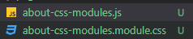
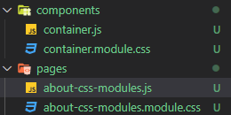

## 우선 프로젝트를 만들고 제일 먼저 접근하게 되는곳은 

index.js 로가게된다 . 

url 은 기본 url 

about.js를 만들고 저기로 접근하고 싶으면

기본 url/about

## gatsby 내에서의 링크연결

`<Link to="/contact/">Contact</Link>` : 이게 url 을 의미하는건지 페이지를 의미하는건지 잘 모르겟음

페이지를 만들면 자동으로 url이 페이지 이름이 되는것 같기도 하다 

`<Link to='/'> home</Link>`

## Css적용하기

pages 밑에 css를 만들어도 되고 

`import styles from "./about-css-modules.module.css"` 이런형식

혹은 

 

위에 컨테이너를 놓고 

`import containerStyles from "./container.module.css"`

이렇게 해도 가능 하다고 한다 도큐먼트를 참조하자 

## CSS in JS

https://www.gatsbyjs.org/docs/emotion/

https://www.gatsbyjs.org/docs/styled-components/ 

위 두가지를 참고 

